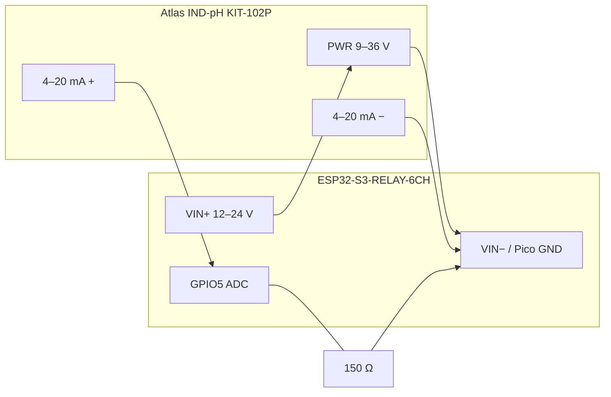

# pH probe and Stenner 45M5 acid dosing

For a **50,000 gallon** pool with **31% muriatic acid** and a **Stenner 45M5** (120 V, 1.7 A, #5 tube, **2.5–50 GPD** depending on the dial).

pH hardware is the **[Atlas Scientific Industrial pH Kit](https://atlas-scientific.com/kits/industrial-ph-kit/)** (SKU **KIT-102P**): DIN-rail **Industrial pH Transmitter** (IND-pH / IXIAN) plus the **industrial 3/4″ NPT probe**. Firmware substitutions are set for this kit: isolated **4-wire** 4–20 mA, **0–14 pH**, **150 Ω** shunt on **GPIO5**.

Lights stay on **CH6**. Acid uses **CH2**. Do **not** put the Stenner on CH1 — that GPIO still belongs to the unused waterfall switch in `schedule.yaml`. Leave **Waterfall (Auto) OFF** in Home Assistant so CH1 does not chatter.

## Relays on the Waveshare ESP32-S3-RELAY-6CH

| Channel | GPIO | Use |
|---------|------|-----|
| CH1 | GPIO1 | Unused (waterfall YAML — leave off) |
| **CH2** | **GPIO2** | **Stenner 45M5 hot** |
| CH6 | GPIO46 | Pool lights (existing) |

## Stenner electrical (CH2)

Switch **only the 120 V hot**. Neutral and ground stay continuous.

```
Panel 120 V hot ──> CH2 COM
CH2 NO ────────────> Stenner black (hot)
Stenner white ─────> Neutral
Stenner green ─────> Ground
```

1.7 A is well under the 10 A relay. Add an **RC snubber** (or MOV) across the Stenner motor leads if the relay pits or Wi‑Fi blips when it clicks — it is an inductive motor.

`restore_mode` is always off. Home Assistant cannot leave the pump on; only a timed pulse script can energize it. A 1-second watchdog force-offs if that fails.

## Plumbing (25 PSI max)

The 45M5 is rated **25 PSI**. Inject into the **return after the filter** (and after a heater if you have one), never into the filter inlet / head-pressure port, and **never into the pH sample loop** (that stream returns to pump suction).

Keep the injection check valve. Prime suction from the acid tank with the pump running using **Acid Prime 10s**.

## Stenner dial

At **100%** the 45M5 is about **4.4 fl oz/min** — too fast to hold on for a 50k pool. Set the mechanical dial to about **20–30%** (~10–15 GPD, ~0.9–1.3 oz/min), then let the ESP pulse.

Default firmware pulse is **10 seconds**, then **15 minutes** settle, max **1200 s (20 min) per calendar day**. Measure actual output with a graduated cylinder (tube wear and dial both matter).

Rough chemistry (31% HCl, 50,000 gal, typical TA): on the order of **tens of ounces** to move pH ~0.2. That is many 10 s pulses over hours, which is the point — no single dump.

## Atlas Industrial pH Kit (KIT-102P)

| In the kit | Role |
|------------|------|
| Industrial pH Transmitter (IND-pH) | Isolated **4-wire** transmitter: 9–36 VDC power, **4–20 mA = 0–14 pH**, 35 mm DIN rail, local display and buttons |
| Industrial pH probe | 3/4″ NPT body, ~10 ft cable, double-junction. Order **with PT-1000** so the transmitter can temperature-compensate |
| pH 4 / 7 / 10 pouches + storage pouch | First calibration only; buy bottles for later |

Do **not** wire the glass probe to the ESP32. The transmitter does the high-impedance work; the ESP only reads the 4–20 mA loop.

This is **not** the Yosoo filter-pressure wiring. Yosoo is a 2-wire loop (power and signal are the same pair). Atlas is **4-wire**: power on one pair, isolated 4–20 mA on another.

### Extra parts (not in the kit)

| Item | Notes |
|------|--------|
| **Second** 150 Ω 1% metal-film, ≥0.25 W | Dedicated shunt. Do not share the filter-pressure resistor. **Not 250 Ω** (20 mA × 250 Ω = 5 V, above the ESP32 ADC). |
| 35 mm DIN-rail snippet | Transmitter is DIN-rail only and is **not** weatherproof. Mount it dry next to the Waveshare board. |
| 1″ × 3/4″ FNPT tee (or 1″ tee + 3/4″ bushing) | Probe is 3/4″ NPT. Atlas’s cheap lab “probe pipe fitting” is the wrong body. |
| Isolation ball valves on the sample loop | Close them **full of water** for calibration or to keep the glass wet. |
| PTFE tape | 3/4″ NPT into the tee. Keep tape off the flat sensing face. |

Board **VIN must be 12–24 V DC** (same supply as the Yosoo). USB 5 V will not run this transmitter (it needs 9–36 V). Atlas minimum is 9 V; 12 V is the practical floor with the pressure loop.

### Probe plumbing (1″ sample loop)

Reuse the old discharge-to-suction 1″ PVC cell:

- Takeoff **after the pump**, return **before the pump**. After-filter takeoff is cleaner if the piping can move; after the CircuPool cell is worse (gas / high chlorine on the glass).
- Probe in a **1″ × 3/4″ FNPT** tee. Water should sweep the flat face (slight angle or vertical). Not upside down (gel void). Not in a dead-end trap.
- Keep the cell a **low wet pocket** so it cannot drain when the IntelliFlo stops. A light check on the suction return is optional; a U-bend is more reliable than stiff spring checks (those can stall at Speed 1).
- Leave sample valves **open** in normal use. RPM interlocks prove the IntelliFlo is running, not that this bypass is open.
- If you blow the lines for winter, **pull the probe** into storage solution.

### Transmitter terminals

Connect only **power**, **pH probe**, **PT-1000** (if present), and **4–20 mA**. Leave the rest disconnected.

| Terminal | Connect to | Notes |
|----------|------------|--------|
| **PWR + / PWR −** (larger keyed plug, 9–36 V) | Board **VIN+** / **VIN−** | Separate from the 4–20 mA pair |
| **pH** (two wires) | Probe pH pair | Reverse does not damage the probe; readings will be wrong |
| **TEMP** (two wires) | Probe PT-1000 | No polarity |
| **4–20 mA + / −** | GPIO5 shunt (below) | Isolated current source. 4 mA = 0 pH, 20 mA = 14 pH |
| **F** (fault) | **Nothing** | Outputs **12–24 V** (same as PWR). Will destroy an ESP GPIO |
| **4 / 7 / 10** (PLC cal) | **Nothing** | Optional PLC strobes; calibrate with the buttons instead |

### 4–20 mA wiring (GPIO5)

Pico pin 7 is **GP5**, next to GP4 (filter pressure on pin 6). Use Pico **GND** (pin 3 or 8), not RS485 **G** (isolated). If you later add a Hall clamp on the CircuPool cell, use another ADC1 pin (**GPIO6 / 7 / 8 / 9**), not GPIO4 or GPIO5.

```
Board VIN+ (12–24 V)  ──────►  transmitter PWR +
Board VIN−            ──────►  transmitter PWR −

transmitter 4–20 mA +  ──┬──►  GPIO5  (Pico GP5 / physical pin 7)
                         └── [150 Ω 1%] ──► Pico GND ──► transmitter 4–20 mA −
```



At 150 Ω (firmware `ph_shunt_ohms: "150.0"`):

| Loop current | Atlas pH | Voltage on GPIO5 |
|--------------|----------|------------------|
| 4.00 mA | 0.00 | 0.60 V |
| 12.00 mA | 7.00 | 1.80 V |
| 12.46 mA | 7.40 | 1.87 V |
| 20.00 mA | 14.00 | 3.00 V |

ESP32 ADC max is about 3.1 V at 12 dB attenuation, so 3.00 V at pH 14 is intentional headroom. **pH Loop Current** and **pH Loop Voltage** on the device page are the diagnostics.

Below ~3.5 mA or above ~21 mA the firmware publishes `Pool pH` as unknown (open wire / short) and **Acid Interlock OK** stays off.

### Substitutions (`ha-pool-controller.yaml` / `pool-controller.yaml`)

These values are for KIT-102P. Do not change the pH scale unless you replace the transmitter.

```yaml
acid_pump_pin: GPIO2
ph_sensor_pin: GPIO5
ph_shunt_ohms: "150.0"
ph_scale_low: "0"
ph_scale_high: "14"
```

### Calibrate on the transmitter, then trim the loop

The ESP does not store pH calibration. Buffers are done **on the Atlas** (display / buttons). **CAL 7 first** — that resets stored points; then 4 and 10.

1. Probe in pH 7. Hold the **orange** button ~1.5 s (`CAL7` → `donE`).
2. Rinse, pH 4, **red** button. Optional pH 10, **blue** button.
3. Trim 4–20 mA so Home Assistant matches: hold **red + blue** ~1.5 s. Adjust 20 mA until **Pool pH** just hits 14.000, save; then 4 mA until 0.000. Use **pH Loop Current** as a check (pH 7 buffer → 12.00 mA).

A two-point 7 then 4 is enough for a pool. The kit pouches are one first cal; keep bottles of 7 and 4 on the pad.

## Interlocks (auto and Acid Pulse)

All must pass:

- IntelliFlo running and RPM ≥ **Acid Min Pump RPM** (default 1200)
- Filter loop not in fault
- pH between **6.8 and 8.6** (probe in water, not failed)
- pH not already below **7.1**
- Today’s runtime under **Acid Max Seconds Today**
- After a pulse, wait **Acid Settle Minutes**

**Acid Auto Dose** uses hysteresis: a correction starts when pH ≥ **Acid pH Start** (default 7.6) and keeps pulsing until pH ≤ **Acid pH Target** (7.4). Auto does **not** come back on after a reboot — you have to enable it again.

**Acid Prime 10s** only requires the circulation pump at min RPM (for filling tubing).

Until the pH loop reads ~4–20 mA, **Acid Interlock OK** stays off and auto-dose will not run.

## First-week checkout

1. Wire CH2 and confirm **Acid Prime** with a bucket on the discharge (pump on, auto **off**).
2. Power the Atlas from VIN (display on). Confirm **pH Loop Current** is in the 4–20 mA range with the probe in water.
3. Calibrate 7 then 4 on the transmitter; confirm Home Assistant **Pool pH** against the buffers, then a Taylor test of the pool.
4. Leave **Acid Auto Dose off**. Use one **Acid Pulse** and watch pH over 30+ minutes.
5. Enable auto only after a pulse matches a Taylor/FAS-DPD sanity check.

Turn auto **off** when vacuuming, backwashing, or working on the pad.
