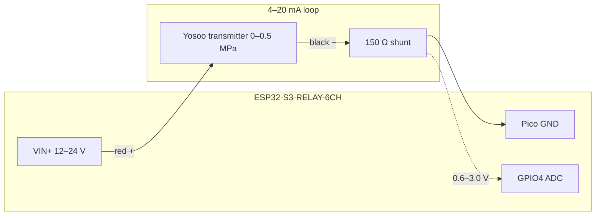

# Filter tank head-pressure sensor

This adds filter-tank pressure measurement to the Waveshare **ESP32-S3-RELAY-6CH** using a 2-wire **4–20 mA** transmitter such as:

[Yosoo Silicon Pressure Transmitter, 4–20 mA, G1/4, 0–0.5 MPa (ASIN B07NQ36XTC)](https://www.amazon.com/gp/product/B07NQ36XTC)

The IntelliFlo `Pressure` entity already in Home Assistant is the **pump’s internal reading** (bar). This package is a separate gauge on the **filter tank** so you can see when the cartridge/sand needs cleaning.

## Sensor specs (this listing)

| Item | Value |
|------|--------|
| Output | 4–20 mA (loop-powered, typically 2-wire) |
| Range | 0–0.5 MPa (0–5 bar, **0–72.5 psi**) |
| Supply | **8–32 V DC** (do not power from 5 V USB or 3.3 V) |
| Thread | **G1/4** (BSPP, not NPT) |
| Media | Water, air, oil (stainless body) |

Pool sand/cartridge filters usually run in the **8–25 psi** range, so 0–0.5 MPa is a good fit.

## Parts

| Part | Notes |
|------|--------|
| 150 Ω, 1% metal-film resistor, ≥0.25 W | Current-to-voltage shunt. **Do not use 250 Ω** — 20 mA × 250 Ω = 5 V, which can damage the ESP32 ADC. |
| 12–24 V DC supply on the board VIN screw terminal | Same supply can power the ESP and the 4–20 mA loop. USB-only 5 V is not enough for the transmitter. |
| Optional 3.3 V zener (e.g. 1N4728A) | Across GPIO4–GND as a clamp if a wire comes loose. |
| Optional 0.1 µF ceramic | GPIO4 to GND, close to the header, to quiet the ADC. |
| G1/4 female → 1/4" NPT male adapter | Most US filter gauge ports are **1/4" NPT**. The Yosoo thread is **G1/4**. |
| Brass tee | Keep the mechanical gauge and add the transmitter on the same port. |
| PTFE tape | On the NPT/adapter side. G1/4 BSPP often needs a bonded washer or O-ring, not just tape. |

## ESP32 pin (Pico HAT header)

GPIO4 is **ADC1_CH3** (safe to use with WiFi). Relays do **not** use GPIO4:

| Relay | ESP32 GPIO |
|-------|------------|
| CH1 | GPIO1 |
| CH2 | GPIO2 |
| CH3 | GPIO41 |
| CH4 | GPIO42 |
| CH5 | GPIO45 |
| CH6 | GPIO46 |

Dallas 1-Wire is already on **GPIO10** (Pico **GP10**, physical pin 13). The Atlas Industrial pH Kit uses **GPIO5** (Pico **GP5**, pin 7) with its **own** 150 Ω shunt on a **4-wire** 4–20 mA output — do not share this Yosoo loop; see [ACID_PH.md](ACID_PH.md).

Use Pico **GP4**, physical **pin 6**:

```
USB / Type-C end of the 40-pin Pico header
Pin 1  GP0          GP1  Pin 2
Pin 3  GND          GP2  Pin 4
Pin 5  GP3          GP4  Pin 6   ← ADC (GPIO4)
Pin 7  GP5          GND  Pin 8   ← extra GND
...
Pin 13 GP10         GP11 Pin 14  ← existing Dallas 1-Wire
```

**GND:** Pico pin 3 or 8 (same ground as the Dallas sensors).

**Do not** use the RS485 **G** terminal for this circuit. That ground is isolated from the ESP32.

**Do not** power the transmitter from Pico 3.3 V or 5 V.

## Electrical diagram

Two-wire 4–20 mA loop (typical Yosoo: **red = +**, **black = signal**. Confirm on the sensor body — colors vary):

```
 12–24 V DC
 board VIN+ ────── red (transmitter +)
                          │
                   [Yosoo 4–20 mA]
                          │
                     black (loop −)
                          │
                          ├──────── GPIO4  (Pico GP4 / pin 6)
                          │
                       [150 Ω 1%]
                          │
 Pico GND ────────────────┴──────── board VIN−
 (header pin 3 or 8)
```



At 150 Ω:

| Loop current | Meaning | Voltage on GPIO4 |
|--------------|---------|------------------|
| 4 mA | 0 psi (0 MPa) | 0.60 V |
| 12 mA | 36.3 psi (mid-scale) | 1.80 V |
| 20 mA | 72.5 psi (0.5 MPa) | 3.00 V |

ESP32 ADC max is about 3.1 V at 12 dB attenuation, so 3.00 V at full scale is intentional headroom.

### If your unit is 3-wire

Some batches bring out a separate ground:

- Red → VIN+
- Black → Pico GND
- Blue/green signal → top of the 150 Ω shunt (other end of shunt to Pico GND, tap to GPIO4)

## Plumbing

1. Kill power to the pump. Isolate and depressurize the filter (open the air relief / drain as your filter manual describes).
2. Remove the mechanical gauge, or install a **tee** so the gauge stays.
3. Fit the G1/4 → NPT adapter if needed. Do not crank a stainless G1/4 sensor hard into a plastic NPT port.
4. Mount the transmitter **upright** if the body has a cable gland, with the cable dripping down so water does not run into the connector.
5. Restart the pump and check for leaks **before** sealing the electrical box.

## Firmware substitutions

In `esphome/pool-controller.yaml`:

```yaml
substitutions:
  filter_pressure_pin: GPIO4
  filter_pressure_shunt_ohms: "150.0"
  filter_pressure_full_scale_mpa: "0.5"
```

If you bought a different Yosoo range (0–0.2 / 1.0 / 1.6 MPa), change `filter_pressure_full_scale_mpa` to match the label on the sensor.

If you use a different shunt (120 Ω is also safe), set `filter_pressure_shunt_ohms` to that value. Stay at or below **150 Ω** so 20 mA cannot exceed ~3.1 V.

## Entities

| Entity | Purpose |
|--------|---------|
| **Filter Tank Pressure** | Head pressure in psi |
| **Filter Tank Pressure Bar** | Same reading in bar (compare to IntelliFlo pressure) |
| **Filter Loop Current** | Diagnostic mA; ~4 mA at rest, ~8–16 mA while the pump is on |
| **Filter Pressure Voltage** | Raw ADC volts |
| **Filter Clean Speed 1–4** | Learned (or manually set) clean-filter psi at that speed. 0 = not learned yet |
| **Filter Est Speed 1–4** | Effective clean psi: learned value if present, otherwise estimated from other speeds |
| **Filter Clean Baseline** | Clean psi used right now |
| **Filter Pressure Over Clean** | Current psi minus baseline. Backwash when this reaches **Filter Pressure Rise** |
| **Filter Pressure Rise** | Trip delta (default **10 psi**, Pentair Triton II) |
| **Filter Learn Hours** | How long a speed must run before a baseline is learned (default **2**, max 48) |
| **Filter Learn Time** | Hours of Speed 1–4 runtime collected toward the current learn window |
| **Filter Needs Backwash** | Problem binary sensor (stays on after the pump stops) |
| **Filter Backwash Detail** | Why it is or is not calling for a backwash |
| **Filter Pressure Fault** | Loop &lt; 3.5 mA (open) or &gt; 21 mA (short) |
| **Save Clean Filter Pressure** | Optional: store the current reading now instead of waiting to learn |
| **Reset Filter Baselines** | Clear learned values and start over (sand change, etc.) |

Pentair’s Triton II TR140 manual: backwash at **+10 psi** over the clean reading. Leave rise at 10.

### How baselines are learned

You do **not** have to press Save. Example: Speed 1 at 1500 RPM, lowest 2-hour average is 8 psi → **Filter Clean Speed 1** becomes 8 psi → trip at **18 psi**.

The firmware:

1. Ignores the first 10 minutes after the IntelliFlo starts (air purge / prime).
2. While RPM is within ~200 of Speed 1–4, records 5-minute averages.
3. After **Filter Learn Hours** of that speed’s runtime (default 2, not necessarily one continuous wall-clock block), takes the **lowest** N-hour average seen.
4. Only **lowers** a baseline after that (a dirty week cannot raise the clean number). After a backwash, a lower stretch updates it.
5. Speeds you have not run yet are estimated from the ones you have (`head ≈ a + b·RPM²`).

Set **Filter Learn Hours** to 4 or 8 if you want a longer, more conservative window. Save is still there if you just backwashed and do not want to wait. **Reset Filter Baselines** after new sand.

The backwash flag only **updates** while the pump is running near a known speed. If it trips, it **stays on** after the pump shuts off so Home Assistant can still notify you at night.

## Checkout

1. Power the Waveshare board from **12–24 V** on the VIN screw terminal (not USB alone).
2. With the transmitter disconnected, Filter Loop Current should drop and **Filter Pressure Fault** should turn on.
3. With the transmitter connected and the pump **off**, expect roughly **4 mA / ~0 psi** (plus a little gauge offset).
4. Start the pump; pressure should rise into the same ballpark as the mechanical gauge (often within 1–2 psi; cheap transmitters are about ±1.5% FS).
5. If the reading is stuck near 0 or the fault stays on, swap red/black — a reversed 2-wire loop reads as an open circuit.

## Home Assistant

After the ESPHome API reconnects you should see `sensor.filter_tank_pressure` and `binary_sensor.filter_needs_backwash` (`device_class: problem`). A simple notify:

```yaml
automation:
  - alias: Pool filter needs backwash
    trigger:
      - platform: state
        entity_id: binary_sensor.pool_controller_filter_needs_backwash
        to: "on"
    action:
      - service: notify.mobile_app_your_phone
        data:
          title: Pool filter
          message: "TR140 is about +10 psi over clean. Time to backwash."
```

Replace the entity_id and notify target with the names Home Assistant actually assigned. You can also put **Filter Needs Backwash** on a dashboard badge and skip the automation until you want a push.
